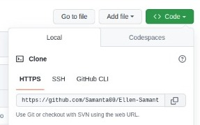
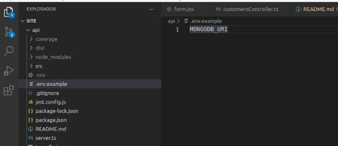
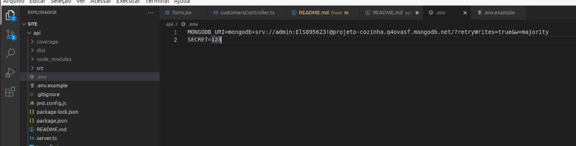
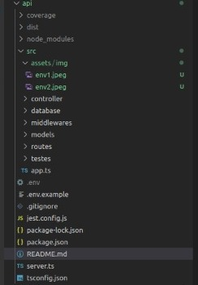
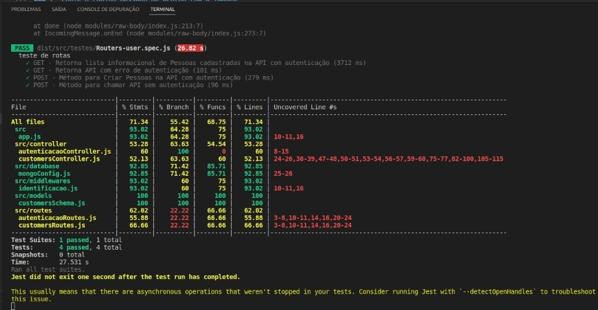

# Projeto guiado para vaga de desenvolvimento Back-end

### autor(a): 'Ellen Samanta Nunes da Silva'
### Vídeo explicativo sobre o projeto encontrado em : https://www.youtube.com/watch?v=_VuXWYnqtT8&feature=youtu.be

## Afim de divulgar uma demonstração sobre os conhecimentos adquiridos em Back-end foi feito um Projeto Implementado com React, Node, Jest, Typescript, MongoDB, javascript, Html e css.

## Para adquirir o uso do projeto você pode seguir as instruções que serão passadas:

### 1° Entre no repositório pelo link https://github.com/Samanta00/Ellen-Samanta-Nunes-da-Silva

### 2° Copie o código passado de acordo com a imagem

### 3° Em seu terminal digite git clone https://github.com/Samanta00/Ellen-Samanta-Nunes-da-Silva.git

### 4° após ter todo o código clonado digite npm install para pode instalar todas as dependência e configurações necessárias para o projeto rodar

### 5° Para rodar o Back-end será necessário ir na pasta do projeto chamada api, após isso ir no terminar e dar um npm run dev

### 6° Para rodar os testes feito em jest, você precisa ir no terminal da pasta chamada Api e dar um npm run test

### 7° Caso o projeto venha sem alguns arquivos no .env será necessário criar novamente um .env passando a url de um banco mongoose, banco necessário para o armazenamento de dados, e uma senha secreta para o secret, função necessária para gerar um usuário autenticado, imagens abaixo são como o exemplo esperado

## Arquitetura do Projeto em Back-end

## Testes validados pelo Jest

# Getting Started with Create React App

This project was bootstrapped with [Create React App](https://github.com/facebook/create-react-app).

## Available Scripts

In the project directory, you can run:

### `npm start`

Runs the app in the development mode.\
Open [http://localhost:3000](http://localhost:3000) to view it in your browser.

The page will reload when you make changes.\
You may also see any lint errors in the console.

### `npm test`

Launches the test runner in the interactive watch mode.\
See the section about [running tests](https://facebook.github.io/create-react-app/docs/running-tests) for more information.

### `npm run build`

Builds the app for production to the `build` folder.\
It correctly bundles React in production mode and optimizes the build for the best performance.

The build is minified and the filenames include the hashes.\
Your app is ready to be deployed!

See the section about [deployment](https://facebook.github.io/create-react-app/docs/deployment) for more information.

### `npm run eject`

**Note: this is a one-way operation. Once you `eject`, you can't go back!**

If you aren't satisfied with the build tool and configuration choices, you can `eject` at any time. This command will remove the single build dependency from your project.

Instead, it will copy all the configuration files and the transitive dependencies (webpack, Babel, ESLint, etc) right into your project so you have full control over them. All of the commands except `eject` will still work, but they will point to the copied scripts so you can tweak them. At this point you're on your own.

You don't have to ever use `eject`. The curated feature set is suitable for small and middle deployments, and you shouldn't feel obligated to use this feature. However we understand that this tool wouldn't be useful if you couldn't customize it when you are ready for it.

## Learn More

You can learn more in the [Create React App documentation](https://facebook.github.io/create-react-app/docs/getting-started).

To learn React, check out the [React documentation](https://reactjs.org/).

### Code Splitting

This section has moved here: [https://facebook.github.io/create-react-app/docs/code-splitting](https://facebook.github.io/create-react-app/docs/code-splitting)

### Analyzing the Bundle Size

This section has moved here: [https://facebook.github.io/create-react-app/docs/analyzing-the-bundle-size](https://facebook.github.io/create-react-app/docs/analyzing-the-bundle-size)

### Making a Progressive Web App

This section has moved here: [https://facebook.github.io/create-react-app/docs/making-a-progressive-web-app](https://facebook.github.io/create-react-app/docs/making-a-progressive-web-app)

### Advanced Configuration

This section has moved here: [https://facebook.github.io/create-react-app/docs/advanced-configuration](https://facebook.github.io/create-react-app/docs/advanced-configuration)

### Deployment

This section has moved here: [https://facebook.github.io/create-react-app/docs/deployment](https://facebook.github.io/create-react-app/docs/deployment)

### `npm run build` fails to minify

This section has moved here: [https://facebook.github.io/create-react-app/docs/troubleshooting#npm-run-build-fails-to-minify](https://facebook.github.io/create-react-app/docs/troubleshooting#npm-run-build-fails-to-minify)

